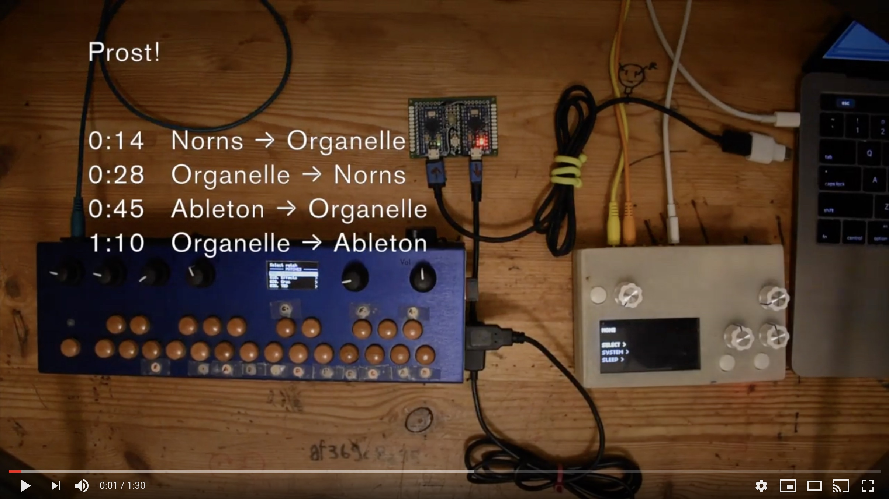
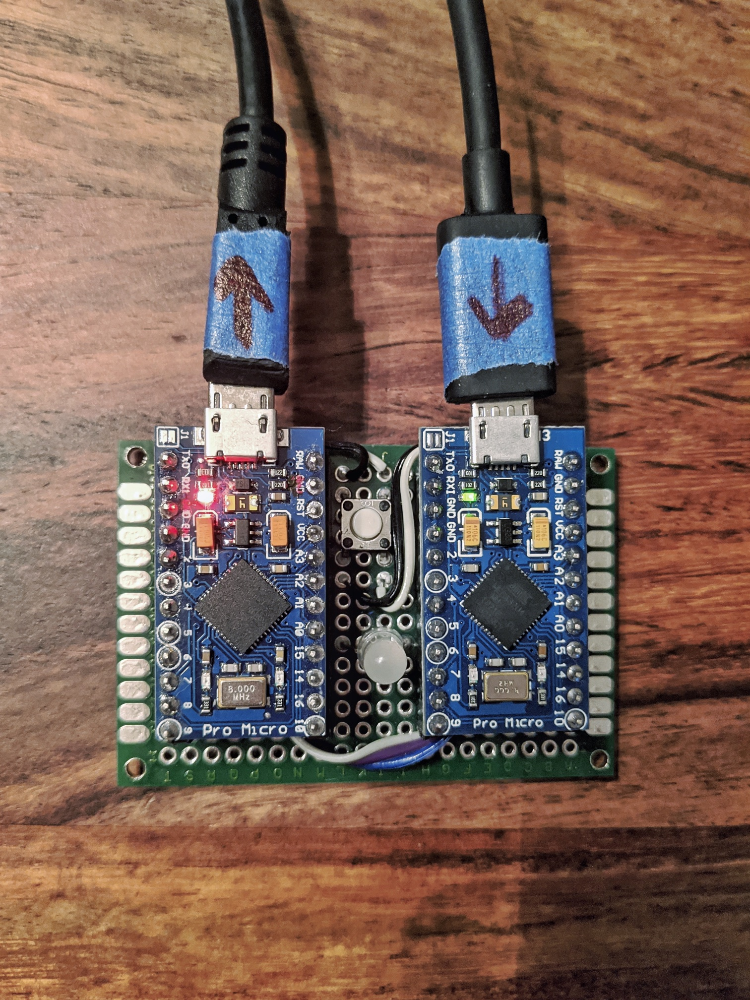
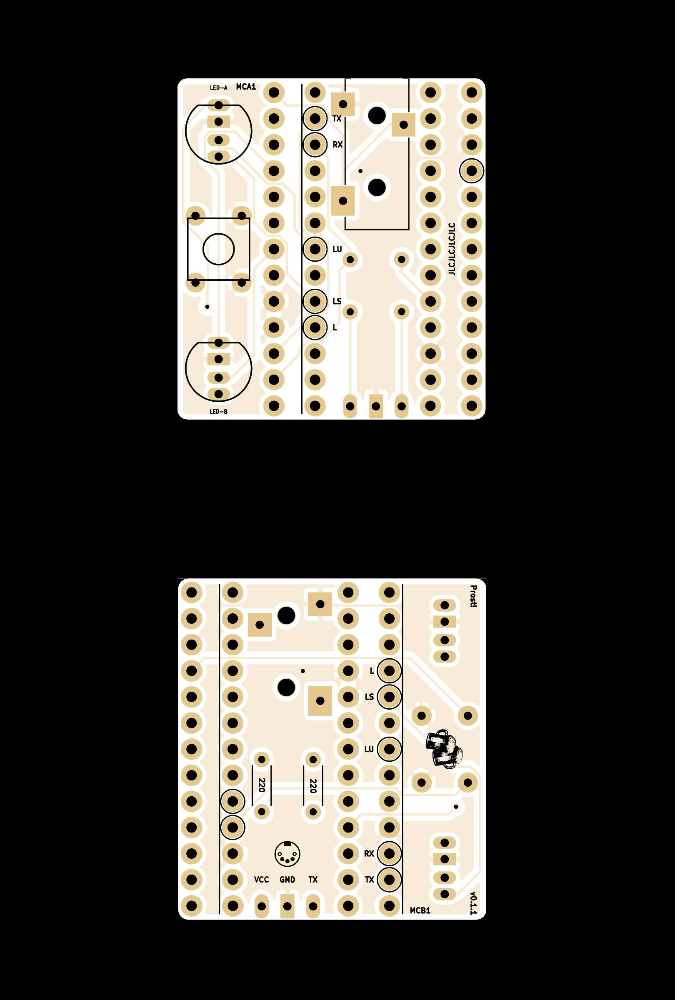
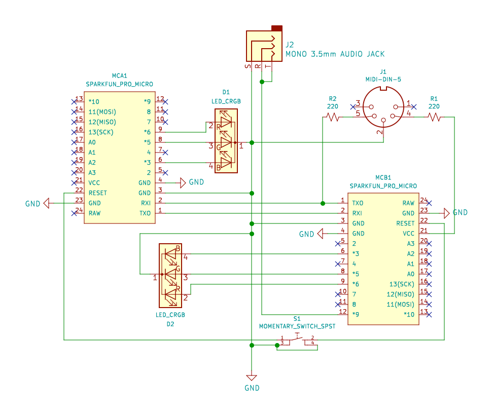

# 🍻 Prost!

v.0.1.2

### Prost! uses Arduino Pro Micros as intermediary to allow Midi host to Midi host communication.

<sub>(Pros + Host) x 2 = [Prost!](https://dictionary.cambridge.org/dictionary/german-english/prost) SWDIT?</sub>

Here's a brief [demo video](https://www.youtube.com/watch?v=BwLtm9UBdX8) with [Ableton Live](https://www.ableton.com/), an [Organelle](https://www.critterandguitari.com/organelle), and [Norns/Fates](https://llllllll.co/t/fates-a-diy-norns-dac-board-for-raspberry-pi/). 

[](https://www.youtube.com/watch?v=BwLtm9UBdX8&feature=youtu.be)

------
## 💾 Firmware

**Download**

```bash 
$ git clone https://github.com/frederickk/prost.git
```

**Dependencies**

Prost! requires 2 dependencies to build and upload. 

- Install [PlatformIO](https://platformio.org/platformio-ide) this is required to build and flash the Arduinos. You can either install the [CLI](https://platformio.org/install/cli) or the [IDE](https://platformio.org/platformio-ide).
- [USBMIDI](https://github.com/BlokasLabs/usbmidi/) is required for transmitting Midi data over USB, fortunately PlatformIO makes dependency bundling easy.

Before building and flashing be sure to install dependencies.

```bash
  # Install dependencies
  pio lib --storage-dir ./lib install 5841   
```

**Build and Flash**

For 5v / 16MHz boards use:

```bash
  # Build and flash firmware
  pio run -e sparkfun_promicro16 -t upload
```

If using 3.3v / 8MHz boards use:

```bash
  # Build and flash firmware
  pio run -e sparkfun_promicro8 -t upload
```

Be sure to flash both boards 😃.


------
## 🎛️ Hardware

Prost! uses 2 [Pro Micro](https://www.sparkfun.com/products/12587) boards (or any compatible board or clone with an [Atmel 32u4 chip](https://www.amazon.com/s?k=32U4&i=electronics&ref=nb_sb_noss_2)) connected serially (TX/RX) in order to pass USBMidi data. Other boards may work (e.g. Teensy), but I only tested with Pro Micros.

I've created a PCB which reduces the footprint of the device to be only slightly larger than a Pro Micro board itself (38mm x 35mm / 1.25" x 1.375"). Below I've soldered 2 header pins in order to test different boards, but you could solder the boards directly to further reduce the overall thickness (unless you opt to solder on the 3.5mm analog sync jack).




**Board**

A custom PCB is also available. if there's enough interest I would be willing to produce these in bulk and sell either bare PCB's or populated with components. For now you can order them yourself from [JLCPCB](https://jlcpcb.com/quote/gerberview/d1965d72-c9b5-4de7-8c59-df7167853c5e_1_0_6_0_0.html).

Although, the board is designed first and foremost for Pro Micros it can accomodate a number of other boards. Be mindful to align the marked `TX` and `RX` pins on the Prost! PCB with those on your board. 

| Board         | RX | TX | Voltage | Notes |
| ------------- | -- | -- | ------- | ----- |
| [Pro Micro](https://learn.sparkfun.com/tutorials/pro-micro--fio-v3-hookup-guide/hardware-overview-pro-micro) | 0  | 1  | 3.3 or 5 | |
| [Teensy 1.0, ++](https://www.pjrc.com/teensy/td_uart.html) | 2  | 3  | 3.3 or 5 | |
| [Teensy LC, 3.0, 3.1, 3.2, 3.5, 3.6, 4.0](https://www.pjrc.com/teensy/td_uart.html)  | 0  | 1  | 3.3 or 5 | |
| [Arduino Micro](https://content.arduino.cc/assets/Pinout-Micro_latest.pdf) | 20 | 21 | 3.3 or 5 | |
| [Adafruit Feather 32u4, Bluefruit](https://learn.adafruit.com/adafruit-feather-32u4-basic-proto/pinouts) | 0  | 1  | 3.3 | Board must be mounted upside down |
| [Adafruit ItsyBitsy 32u4](https://learn.adafruit.com/introducting-itsy-bitsy-32u4/pinouts) | 0  | 1  | 3 or 5 |





**BOM**

| Qty. | Part No. | Item |
| ---- | -------- | ---- |
| **2**    | | **5V/3.3VV [Pro Micro](https://www.sparkfun.com/products/12587)** |
| **1**    | **[1825910-6](https://octopart.com/1825910-6-te+connectivity-42270338?r=sp)** | **6mm Momentary push button** |
| 2    | [WP154A4SUREQBFZGW](https://octopart.com/wp154a4sureqbfzgw-kingbright-12087875?r=sp) | 5mm RGB LED (optional) |
| 4    | | 1 x 10 female header (optional) |

Syncing with analog Midi devices is also possible. Look for the 5-pin Midi graphic on the board and you'll find pin breakouts to connect a 5-pin Midi connector. Be sure to obtain 2 220 ohm resistors as well.

| Qty. | Part No. | Item |
| ---- | -------- | ---- |
| 1    | [1134](https://octopart.com/1134-adafruit+industries-32978196?r=sp) | 5-pin MIDI connector (optional) |
| 2    | [220R](https://octopart.com/search?q=220+ohm+resistor&currency=USD&specs=0&category_id=6312) | 220 ohm THT resistors (optional) |

Prost! also supports analog sync, which takes the USB Midi clock signal and converts it to 3.3V or 5V (depending on voltage of Pro Micro) pulse; for Volcas, Pocket Operators, etc. There's room on the board for an [SMD 3.5mm/.125" audio jack](https://octopart.com/search?q=CUI+SJ-3523-SMT&currency=USD&specs=0) or pads to solder a jack type of your choice.

| Qty. | Part No. | Item |
| ---- | -------- | ---- |
| 1    | [CUI SJ-3523-SMT](https://octopart.com/search?q=CUI+SJ-3523-SMT&currency=USD&specs=0) | SMD 3.54mm/.125" audio jack (optional) |


**Wiring**

The diagram below shows how to connect the the 2 Pro Micros TX and RX pins. A push button is wired to [reset the bootloader](https://learn.sparkfun.com/tutorials/pro-micro--fio-v3-hookup-guide/all#ts-reset) (for flashing if/as needed). The optional LEDs signal when Midi and Serial commands are being received and sent.



------
## 📜 License

[MIT](https://opensource.org/licenses/MIT)

