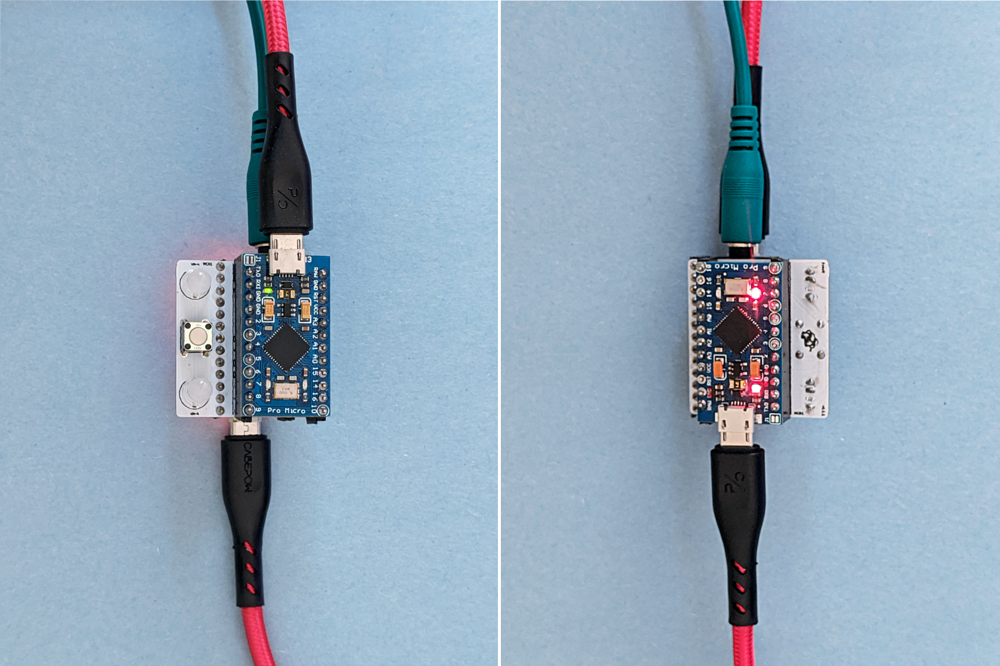

# 🍻 Prost!

v.0.1.0

### Prost! uses Arduino Pro Micros as intermediary to allow Midi host to Midi host communication.

<sub>(Pros + Host) x 2 = [Prost!](https://dictionary.cambridge.org/dictionary/german-english/prost) SWDIT?</sub>

Here's a brief [demo video](https://www.youtube.com/watch?v=BwLtm9UBdX8) with [Ableton Live](https://www.ableton.com/), an [Organelle](https://www.critterandguitari.com/organelle), and [Norns/Fates](https://llllllll.co/t/fates-a-diy-norns-dac-board-for-raspberry-pi/). 

[](https://www.youtube.com/watch?v=BwLtm9UBdX8&feature=youtu.be)

------
## 💾 Firmware

**Download**

```bash 
$ git clone https://github.com/frederickk/prost.git
```


**Dependencies**

Prost! requires 2 dependencies to build and upload. 

- Install [PlatformIO](https://platformio.org/platformio-ide) this is required to build and flash the Arduinos. You can either install the [CLI](https://platformio.org/install/cli) or the [IDE](https://platformio.org/platformio-ide).
- [USBMIDI](https://github.com/BlokasLabs/usbmidi/) is required for transmitting Midi data over USB, fortunately PlatformIO makes dependency bundling easy.

Before building and flashing be sure to install dependencies.

```bash
  # Install dependencies
  pio lib --storage-dir ./lib install 5841   
```


**Build and Flash**

Be sure to flash both boards 😃.

```bash
  # Build and flash firmware
  pio run -e sparkfun_promicro8 -t upload
```


------
## 🎛️ Hardware

Prost! uses 2 [Pro Micro](https://www.sparkfun.com/products/12587) boards (or any compatible board or clone with an [Atmel 32u4 chip](https://www.amazon.com/s?k=32U4&i=electronics&ref=nb_sb_noss_2)) connected serially (TX/RX) in order to pass USBMidi data. Other boards may work (e.g. Teensy), but I only tested with Pro Micros.

For now I'm using a simple protoboard, while I further test. In the future I'll create a custom PCB to make hardware implemenation even easier.



**Wiring**

The diagram below shows how to connect the the 2 Pro Micros TX and RX pins. A push button is wired to [reset the bootloader](https://learn.sparkfun.com/tutorials/pro-micro--fio-v3-hookup-guide/all#ts-reset) (for flashing if/as needed). The optional LEDs signal when Midi and Serial commands are being received and sent.


**BOM**

| Qty. | Item |
| ---- | ---- |
| 2    | [Pro Micro](https://www.sparkfun.com/products/12587) |
| 1    | Momentary push button |
| 2    | Dual-color LED (optional) |
| 4    | 1 x 10 header (optional) |

------
## 📜 License

[MIT](https://opensource.org/licenses/MIT)

